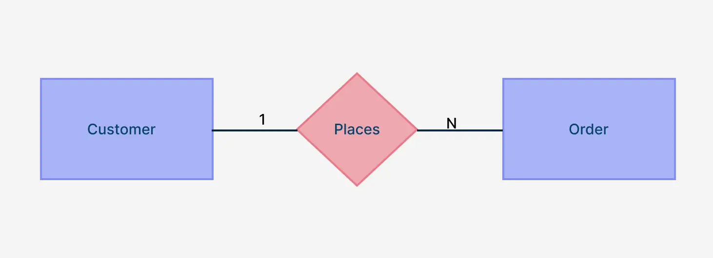
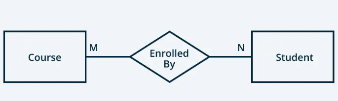

# Relationships

## 1. One to One

- to map a onr-to-one relationship to a table, we can create one table.

## 2. One to Many

- to map a one-to-many relationship to a table, we can create two tables, and the table on the "many" side will have a foreign key that references the primary key of the table on the "one" side.

## 3. Many to Many

- to map a many-to-many relationship to a table, we can create three tables: two tables for the entities and a junction table that contains foreign keys referencing the primary keys of the two entity tables. The junction table may also contain additional attributes related to the relationship. The primary key of the junction table is typically a composite key consisting of the foreign keys from the two entity tables.
