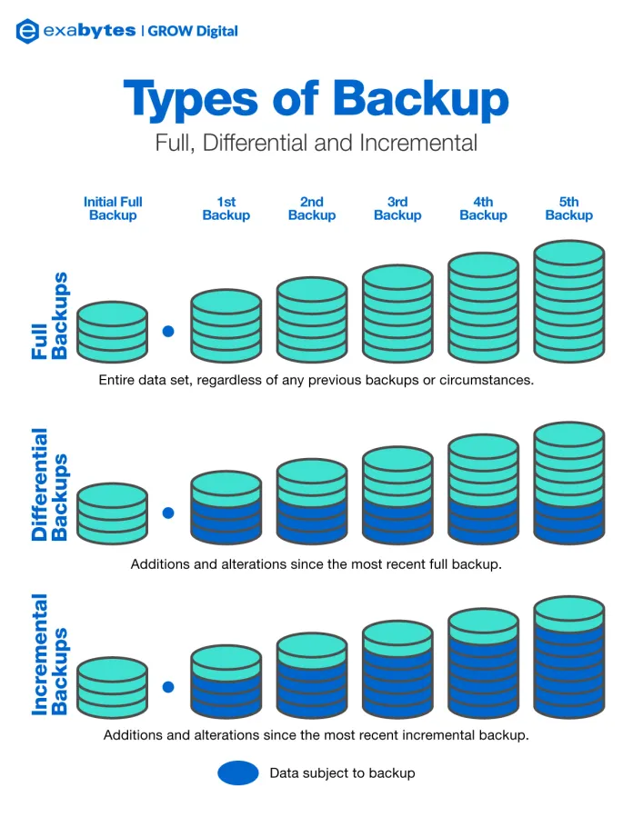

# Backup types

## 1. Full Backup

A full backup copies every single file, folder, and system component in your selected data set. It serves as the baseline for all other backup types.

- Pros: Simplest to restore; you only need this single backup to recover everything.
- Cons: Takes the longest to complete and requires the most storage space.

If we were to perform a full backup every day, we would quickly run out of storage space and waste a lot of time and resources. This is why we have incremental and differential backups, which are more efficient for regular use.

## 2. Incremental Backup

An incremental backup only captures the data that has changed since the very last backup of any type (full or incremental).

- Pros: Extremely fast to create and uses the least amount of storage space and network bandwidth.
- Cons: The slowest restoration process. To restore data, you must perfectly piece together a chain: the initial full backup followed by every single incremental backup made up to the point of failure.

```
First day: Full backup (100GB)
Second day: Incremental backup (10GB)
Third day: Incremental backup (5GB)
Fourth day: Incremental backup (2GB)
```

To restore data from the fourth day, you would need to start with the full backup (100GB), then apply the second day's incremental backup (10GB), followed by the third day's incremental backup (5GB), and finally the fourth day's incremental backup (2GB). This process can be time-consuming and prone to errors if any of the incremental backups are missing or corrupted.

## 3. Differential Backup

A differential backup only captures data that has changed since the most recent full backup.

- Pros: Faster restore times than incremental backups. To recover, you only need the last full backup and the latest differential backup.
- Cons: The size of the backup grows larger with each passing day until the next full backup is performed, requiring more storage space over time.

```
First day: Full backup (100GB)
Second day: Differential backup (10GB)
Third day: Differential backup (15GB) (because it includes the changes from both the second and third days)
Fourth day: Differential backup (17GB) (because it includes the changes from the second, third, and fourth days)
```

To restore data from the fourth day, you would only need the full backup (100GB) and the latest differential backup (17GB). This makes the restoration process much faster compared to incremental backups, as you don't need to piece together multiple backups.



---

## Types of backups and their categories

- sqldump: Full backup
- RDS Automated Backup: Full + Transaction Logs (Point-in-Time Recovery)
- RDS Manual Snapshot: Full backup
